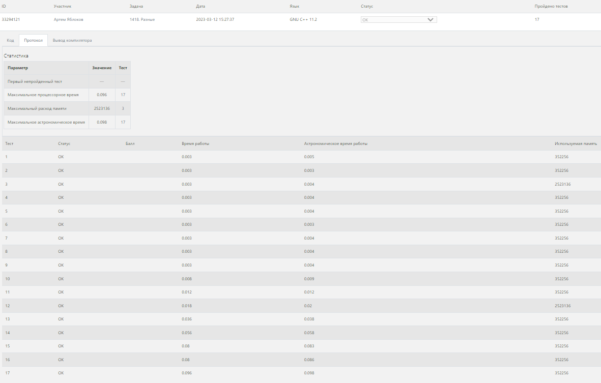
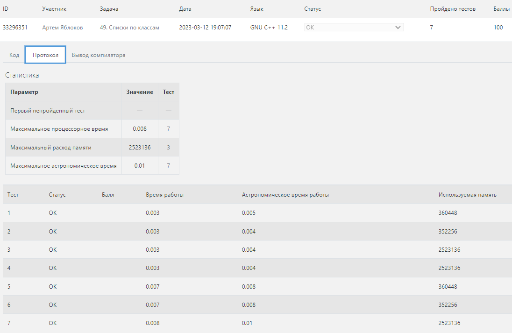
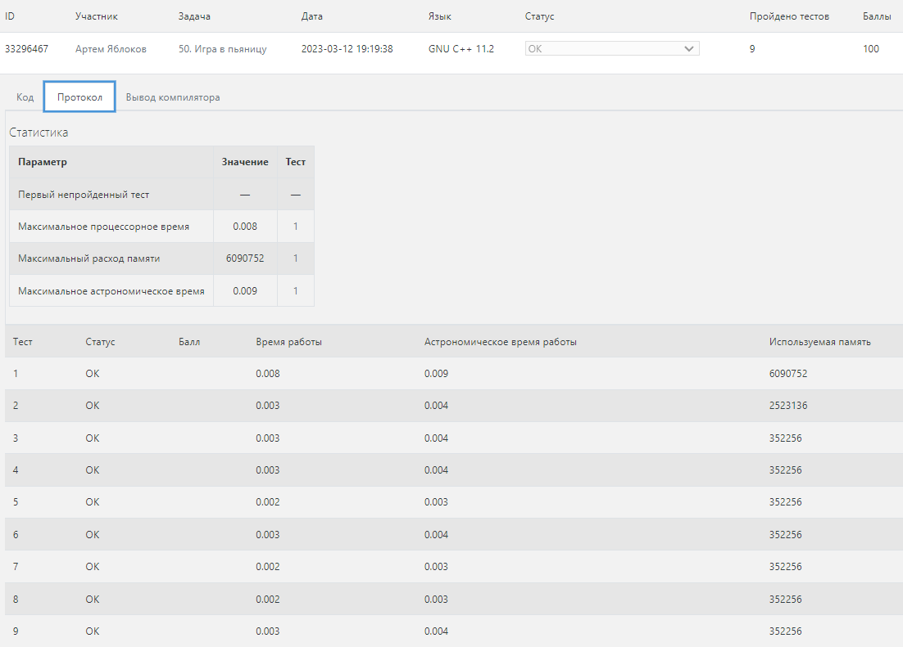
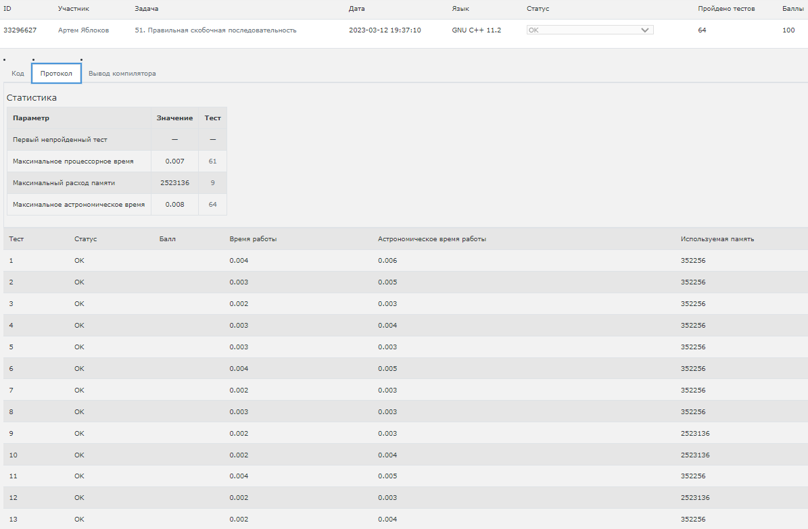
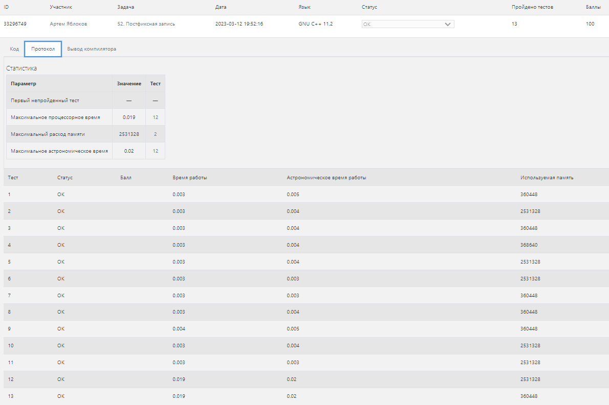

# Лабораторная работа 2

## Задача 1 (Разные)

**Условие:** 
Дано N чисел, требуется выяснить, сколько среди них различных.

Входные данные:
В первой строке дано число N – количество чисел. (1 <= N <= 100000) Во второй строке даны через пробел N чисел, каждое не превышает 2*109 по модулю.

Выходные данные:
Выведите число, равное количеству различных чисел среди данных. 

**Тесты**

## Задача 2 (Списки по классам)

**Условие:**
Формат входных данных:
В каждой строке сначала записан номер класса (число, равное 9, 10 или 11), затем (через пробел) – фамилия ученика. Общее число строк в файле не превосходит 100000. Длина каждой фамилии не превосходит 50 символов.

Формат выходных данных:
Необходимо вывести список школьников по классам: сначала всех учеников 9 класса, затем – 10, затем – 11. Внутри одного класса порядок вывода фамилий должен быть таким же, как на входе.

**Тесты**

## Задача 3 (Игра в пьяницу)

**Условие:** В игре в пьяницу карточная колода раздается поровну двум игрокам. Далее они вскрывают по одной верхней карте, и тот, чья карта старше, забирает себе обе вскрытые карты, которые кладутся под низ его колоды. Тот, кто остается без карт – проигрывает.

Напишите программу, которая моделирует игру в пьяницу и определяет, кто выигрывает. В игре участвует 10 карт, имеющих значения от 0 до 9, большая карта побеждает меньшую, карта со значением 0 побеждает карту 9.

Входные данные:
Программа получает на вход две строки: первая строка содержит 5 чисел, разделенных пробелами — номера карт первого игрока, вторая – аналогично 5 карт второго игрока. Карты перечислены сверху вниз, то есть каждая строка начинается с той карты, которая будет открыта первой.

Выходные данные:
Программа должна определить, кто выигрывает при данной раздаче, и вывести слово first или second, после чего вывести количество ходов, сделанных до выигрыша. Если на протяжении 106 ходов игра не заканчивается, программа должна вывести слово botva.

**Тесты**

## Задача 4 (Правильная скобочная последовательность)

**Условие:** 
Рассмотрим последовательность, состоящую из круглых, квадратных и фигурных скобок. Программа дожна определить, является ли данная скобочная последовательность правильной.

Пустая последовательность явлется правильной. Если A – правильная, то последовательности (A), [A], {A} – правильные. Если A и B – правильные последовательности, то последовательность AB – правильная.

Входные данные
В единственной строке записана скобочная последовательность, содержащая не более 100000 скобок.

Выходные данные
Если данная последовательность правильная, то программа должна вывести строку yes, иначе строку no.

**Тесты**

## Задача 5 (Постфиксная запись)

**Условие:** В постфиксной записи (или обратной польской записи) операция записывается после двух операндов. Например, сумма двух чисел A и B записывается как A B +. Запись B C + D * обозначает привычное нам (B + C) * D, а запись A B C + D * + означает A + (B + C) * D. Достоинство постфиксной записи в том, что она не требует скобок и дополнительных соглашений о приоритете операторов для своего чтения.

Входные данные:
В единственной строке записано выражение в постфиксной записи, содержащее цифры и операции +, -, *. Цифры и операции разделяются пробелами. В конце строки может быть произвольное количество пробелов.

Выходные данные:
Необходимо вывести значение записанного выражения.

**Тесты**

